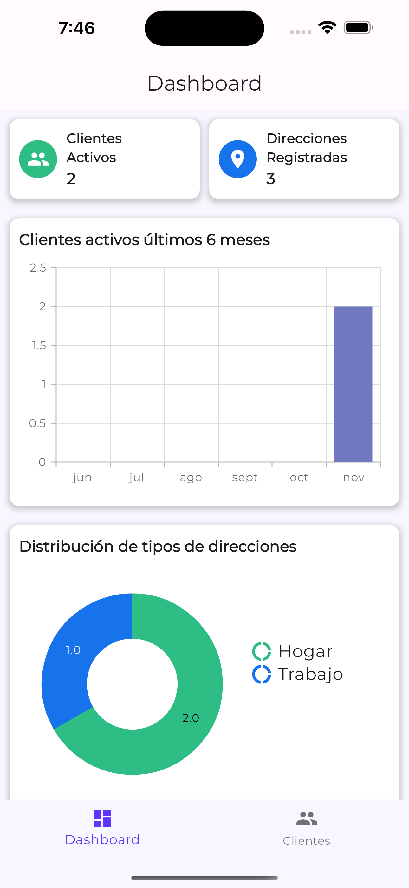
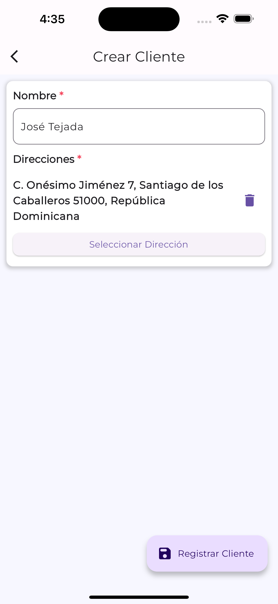
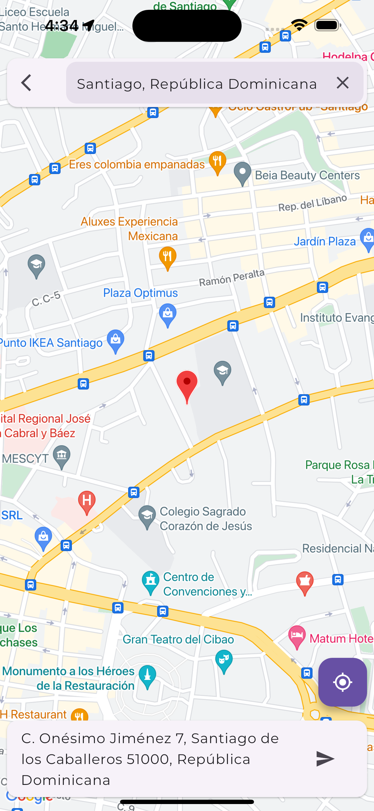

# Prueba Técnica Orion Tek

Bienvenido al repositorio de la prueba técnica de Orion Tek. A continuación se detallarán las funcionalidades y la estructura de la aplicación desarrollada.

<table>
  <tr>
    <td>
      
    </td>
    <td>
      
    </td>
    <td>
      
    </td>

  </tr>
</table>

## Funcionalidades

Con esta app, podrás:

- **Dashboard en tiempo real**: Visualiza la cantidad de clientes, direcciones y gráficas detalladas.
- **CRUD de clientes**: Crea, edita y elimina los clientes y sus direcciones.

## Arquitectura

La app de esta prueba técnica fue desarrollada usando una arquitectura robusta basada en **Clean Architecture**, la cual usa el 'Patrón Repositorio' para el manejo de la data y el patrón 'Visitor' para un manejo de errores comprensible. 

### Componentes Claves

- **Capa Presentación**: Esta capa contiene las vistas y widgets personalizados que componen la interfaz de usuario e interactúa con la capa Dominio. Es la encargada de manejar las interacciones del usuario y presentar la data al usuario.

- **Capa Dominio**: Esta capa es donde reside la lógica de negocio de la aplicación y es la encargada de interactuar con la capa de Data. En esta capa se definen entidades, casos de uso y reglas de negocio.

- **Capa Data**: La capa Data es la responsable de obtener los datos y enviar la información que se va a almacenar/actualizar al servidor. Se utilizó el Patrón Repositorio para abstraer las fuentes de datos, haciendo así más fácil hacer cambios entre las distintas fuentes de data (Ej: API, base de datos local).

- **Core**: En esta capa defino funciones de utilidades, constantes y la lógica para el manejo de errores utilizando el patrón 'Visitor'.
